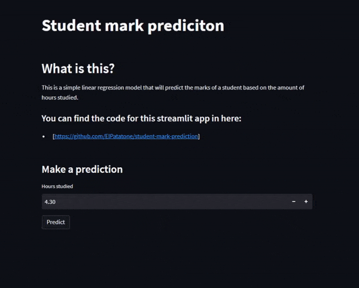

# What is it 

This is a simple linear regression model implementation using sklearn.  
The model will predict the student marks based on the amount of hours studied.  

The model takes in one input, the amount of hours studied, it will then output the predicted mark based on the input.  

I used a small dataset to make it easier to model ([can be found here](http://bit.ly/w-data))  

The aim of this project was to better understand linear regression and get a hands on experience creating a machine learning app 
using the `streamlit` library for the front end and then deploy it using the streamlit cloud service.

I then made a web app using the module `streamlit`  
[Try out the app here :+1: ](https://elpatatone-student-mark-prediction-app-uzrcq8.streamlitapp.com)

### Demo

